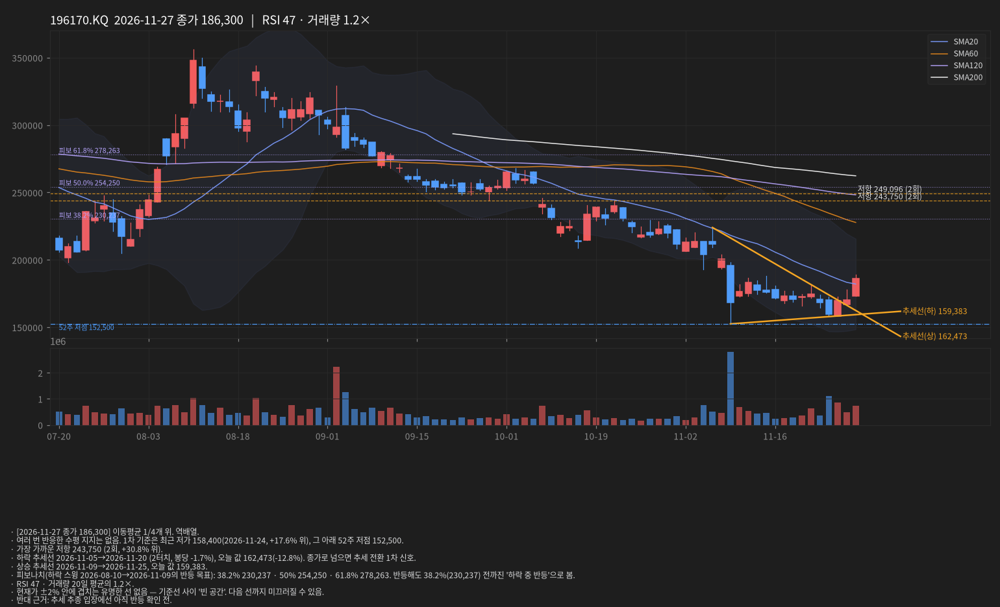
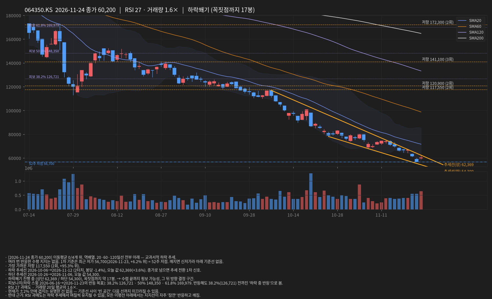

# 선 긋기 리포트 · 2026-11-24 04:12 KST

데이터: 야후 파이낸스 일봉(15분 지연) · 문장은 가능성 표현, 확률 아님

## INFQ · 2026-11-20 종가 6.32

- [2026-11-20 종가 6.32] 이동평균 0/3개 위. 역배열. 20·60·120일선 전부 아래 — 교과서적 하락 추세.
- 여러 번 반응한 수평 지지는 없음. 1차 기준은 최근 저가 6.26(2026-11-20, +1.0% 위) = 52주 저점. 깨지면 신저가라 아래 기준선 없음.
- 가장 가까운 저항 8.41 (2회, +33.1% 위).
- 하락 추세선 2026-09-23→2026-11-09 (2터치, 봉당 -1.1%), 오늘 값 8.40(+33.0%). 종가로 넘으면 추세 전환 1차 신호.
- 하단 추세선 2026-10-20→2026-11-05, 오늘 값 5.75.
- 하락쐐기 진행 중 (상단 8.40 / 하단 5.75), 꼭짓점까지 약 60봉. → 수렴 끝까지 횡보 가능성, 그 뒤 방향 결정 구간.
- 피보나치(하락 스윙 2026-06-03→2026-11-20의 반등 목표): 38.2% 11.15 · 50% 12.66 · 61.8% 14.17. 반등해도 38.2%(11.15) 전까진 '하락 중 반등'으로 봄.
- 종가가 볼린저 하단(6.64) 밖 — 단기 과매도 반등 가능성과 추세 하락 지속이 충돌하는 자리.
- RSI 30 · 거래량 20일 평균의 2.0× → 투매(거래량 동반).
- ★ 합류(아래) 6.26 (-0.9%): 52주 저점 + 최근 저가 — 유명한 선이 겹치는 받침. 한 번 튀어오를 가능성이 높지만 바닥 보장은 아님 → 반등 확인 후 진입.
- 반대 근거: 모든 이평선 아래에서는 지지선이 자주 '잠깐' 반응하고 깨짐.

## 005930.KS · 2026-11-23 종가 177,500

- [2026-11-23 종가 177,500] 이동평균 0/4개 위. 역배열. 20·60·120일선 전부 아래 — 교과서적 하락 추세.
- 여러 번 반응한 수평 지지는 없음. 1차 기준은 최근 저가 171,500(2026-11-23, +3.5% 위). 그 아래는 1년 내 기준선이 멀어 올해 상승분 되돌림 구간(피보나치 참고).
- 가장 가까운 저항 204,000 (2회, +14.9% 위).
- 하락 추세선 2026-10-29→2026-11-13 (2터치, 봉당 -1.2%), 오늘 값 198,000(+11.5%). 종가로 넘으면 추세 전환 1차 신호.
- 하단 추세선 2026-10-15→2026-11-06, 오늘 값 161,806.
- 하락쐐기 진행 중 (상단 198,000 / 하단 161,806), 꼭짓점까지 약 26봉. → 수렴 끝까지 횡보 가능성, 그 뒤 방향 결정 구간.
- 피보나치(하락 스윙 2026-06-19→2026-11-23의 반등 목표): 38.2% 249,046 · 50% 273,000 · 61.8% 296,954. 반등해도 38.2%(249,046) 전까진 '하락 중 반등'으로 봄.
- RSI 33 · 거래량 20일 평균의 0.7×.
- 현재가 ±2% 안에 겹치는 유명한 선 없음 — 기준선 사이 '빈 공간'. 다음 선까지 미끄러질 수 있음.
- 반대 근거: 모든 이평선 아래에서는 지지선이 자주 '잠깐' 반응하고 깨짐.

## 000660.KS · 2026-11-23 종가 1,085,000

- [2026-11-23 종가 1,085,000] 이동평균 0/4개 위. 역배열. 20·60·120일선 전부 아래 — 교과서적 하락 추세.
- 여러 번 반응한 수평 지지는 없음. 1차 기준은 최근 저가 1,044,000(2026-11-23, +3.9% 위). 그 아래는 1년 내 기준선이 멀어 올해 상승분 되돌림 구간(피보나치 참고).
- 가장 가까운 저항 1,090,500 (2회, +0.5% 위).
- 하락 추세선 2026-11-13→2026-11-19 (2터치, 봉당 -2.5%), 오늘 값 1,120,500(+3.3%). 종가로 넘으면 추세 전환 1차 신호.
- 상승 추세선 2026-11-06→2026-11-17, 오늘 값 1,093,714 — 현재가가 이미 아래(이탈).
- 삼각수렴 진행 중 (상단 1,120,500 / 하단 1,093,714), 꼭짓점까지 약 1봉. → 수렴 끝까지 횡보 가능성, 그 뒤 방향 결정 구간.
- 피보나치(하락 스윙 2026-06-25→2026-11-23의 반등 목표): 38.2% 1,786,226 · 50% 2,015,500 · 61.8% 2,244,774. 반등해도 38.2%(1,786,226) 전까진 '하락 중 반등'으로 봄.
- RSI 37 · 거래량 20일 평균의 0.8×.
- ★ 합류(위) 1,092,482 (+0.7%): 수평 저항(2회) + 전저점 + 상승 추세선 — 유명한 선이 겹치는 천장. 여기서 막힐 가능성이 높고, 종가로 넘으면 의미가 큼.
- 반대 근거: 모든 이평선 아래에서는 지지선이 자주 '잠깐' 반응하고 깨짐.

## 277810.KQ · 2026-11-23 종가 402,000

- [2026-11-23 종가 402,000] 이동평균 2/4개 위. 역배열. 
- 가장 가까운 수평 지지 342,000 (2회 반응, +17.5% 위). 깨지면 다음은 300,500(52주 저점).
- 가장 가까운 저항 410,167 (3회, +2.0% 위).
- 하락 추세선 2026-10-07→2026-11-13 (2터치, 봉당 -0.6%), 오늘 값 386,308(-3.9%). 종가로 넘으면 추세 전환 1차 신호.
- 상승 추세선 2026-11-06→2026-11-17, 오늘 값 353,929.
- 피보나치(하락 스윙 2026-06-02→2026-11-06의 반등 목표): 38.2% 508,499 · 50% 572,750 · 61.8% 637,001. 반등해도 38.2%(508,499) 전까진 '하락 중 반등'으로 봄.
- RSI 56 · 거래량 20일 평균의 1.4×.
- 현재가 ±2% 안에 겹치는 유명한 선 없음 — 기준선 사이 '빈 공간'. 다음 선까지 미끄러질 수 있음.
- 반대 근거: 추세 추종 입장에선 아직 반등 확인 전.

## 259960.KS · 2026-11-23 종가 190,900

- [2026-11-23 종가 190,900] 이동평균 0/4개 위. 역배열. 20·60·120일선 전부 아래 — 교과서적 하락 추세.
- 여러 번 반응한 수평 지지는 없음. 1차 기준은 최근 저가 188,400(2026-11-23, +1.3% 위), 그 아래 52주 저점 178,500.
- 가장 가까운 저항 216,167 (3회, +13.2% 위).
- 하락 추세선 2026-11-10→2026-11-20 (2터치, 봉당 -0.7%), 오늘 값 206,375(+8.1%). 종가로 넘으면 추세 전환 1차 신호.
- 상승 추세선 2026-10-30→2026-11-17, 오늘 값 195,167 — 현재가가 이미 아래(이탈).
- 삼각수렴 진행 중 (상단 206,375 / 하단 195,167), 꼭짓점까지 약 4봉. → 수렴 끝까지 횡보 가능성, 그 뒤 방향 결정 구간.
- 피보나치(하락 스윙 2026-06-04→2026-10-30의 반등 목표): 38.2% 212,689 · 50% 223,250 · 61.8% 233,811. 반등해도 38.2%(212,689) 전까진 '하락 중 반등'으로 봄.
- RSI 44 · 거래량 20일 평균의 0.5× → 매수 부재(거래량 없이 하락).
- 현재가 ±2% 안에 겹치는 유명한 선 없음 — 기준선 사이 '빈 공간'. 다음 선까지 미끄러질 수 있음.
- 반대 근거: 모든 이평선 아래에서는 지지선이 자주 '잠깐' 반응하고 깨짐; 거래량 없는 반등은 되돌림이 빠름.

## 010140.KS · 2026-11-23 종가 14,350

- [2026-11-23 종가 14,350] 이동평균 0/4개 위. 역배열. 20·60·120일선 전부 아래 — 교과서적 하락 추세.
- 여러 번 반응한 수평 지지는 없음. 1차 기준은 최근 저가 14,270(2026-11-23, +0.6% 위) = 52주 저점. 깨지면 신저가라 아래 기준선 없음.
- 가장 가까운 저항 15,290 (2회, +6.6% 위).
- 하락 추세선 2026-11-13→2026-11-19 (4터치, 봉당 -1.6%), 오늘 값 15,585(+8.6%). 종가로 넘으면 추세 전환 1차 신호.
- 하단 추세선 2026-10-30→2026-11-09, 오늘 값 15,160 — 현재가가 이미 아래(이탈).
- 피보나치(하락 스윙 2026-06-04→2026-11-23의 반등 목표): 38.2% 20,336 · 50% 22,210 · 61.8% 24,084. 반등해도 38.2%(20,336) 전까진 '하락 중 반등'으로 봄.
- 종가가 볼린저 하단(14,738) 밖 — 단기 과매도 반등 가능성과 추세 하락 지속이 충돌하는 자리.
- RSI 31 · 거래량 20일 평균의 0.6× → 매수 부재(거래량 없이 하락).
- ★ 합류(아래) 14,270 (-0.6%): 52주 저점 + 최근 저가 — 유명한 선이 겹치는 받침. 한 번 튀어오를 가능성이 높지만 바닥 보장은 아님 → 반등 확인 후 진입.
- 반대 근거: 모든 이평선 아래에서는 지지선이 자주 '잠깐' 반응하고 깨짐; 거래량 없는 반등은 되돌림이 빠름.

## 294870.KS · 2026-11-23 종가 23,150

- [2026-11-23 종가 23,150] 이동평균 2/4개 위. 정배열. 
- 가장 가까운 수평 지지 22,988 (4회 반응, +0.7% 위). 깨지면 다음은 16,900(52주 저점).
- 가장 가까운 저항 25,025 (2회, +8.1% 위).
- 하락 추세선 2026-11-05→2026-11-18 (2터치, 봉당 -0.1%), 오늘 값 25,483(+10.1%). 종가로 넘으면 추세 전환 1차 신호.
- 상승 추세선 2026-10-20→2026-11-17, 오늘 값 24,440 — 현재가가 이미 아래(이탈).
- 박스권 22,988~25,025 15봉째. 박스 안에서는 횡보 가능성 높고, 상·하단 종가 이탈이 신호.
- 피보나치(상승 스윙 2026-07-14→2026-11-05의 되돌림): 38.2% 22,493 · 50% 21,425 · 61.8% 20,357. 
- 종가가 볼린저 하단(23,162) 밖 — 단기 과매도 반등 가능성과 추세 하락 지속이 충돌하는 자리.
- RSI 46 · 거래량 20일 평균의 0.3× → 매수 부재(거래량 없이 하락).
- ★ 합류(아래) 22,894 (-1.1%): 전저점 + 최근 저가 + 수평 지지(4회) — 유명한 선이 겹치는 받침. 한 번 튀어오를 가능성이 높지만 바닥 보장은 아님 → 반등 확인 후 진입.
- ★ 합류(위) 23,228 (+0.3%): 볼린저 하단 + SMA60 — 유명한 선이 겹치는 천장. 여기서 막힐 가능성이 높고, 종가로 넘으면 의미가 큼.
- 반대 근거: 거래량 없는 반등은 되돌림이 빠름.

## 251270.KS · 2026-11-23 종가 30,150

- [2026-11-23 종가 30,150] 이동평균 0/4개 위. 역배열. 20·60·120일선 전부 아래 — 교과서적 하락 추세.
- 여러 번 반응한 수평 지지는 없음. 1차 기준은 최근 저가 29,700(2026-11-23, +1.5% 위) = 52주 저점. 깨지면 신저가라 아래 기준선 없음.
- 가장 가까운 저항 30,975 (2회, +2.7% 위).
- 상단 추세선 2026-11-12→2026-11-20 (3터치, 봉당 +0.0%), 오늘 값 33,717(+11.8%). 종가로 넘으면 추세 전환 1차 신호.
- 하단 추세선 2026-09-29→2026-11-06, 오늘 값 29,710.
- 피보나치(하락 스윙 2026-06-02→2026-11-23의 반등 목표): 38.2% 35,659 · 50% 37,500 · 61.8% 39,341. 반등해도 38.2%(35,659) 전까진 '하락 중 반등'으로 봄.
- 종가가 볼린저 하단(30,283) 밖 — 단기 과매도 반등 가능성과 추세 하락 지속이 충돌하는 자리.
- RSI 36 · 거래량 20일 평균의 0.8×.
- ★ 합류(아래) 29,705 (-1.5%): 52주 저점 + 최근 저가 + 하단 추세선 — 유명한 선이 겹치는 받침. 한 번 튀어오를 가능성이 높지만 바닥 보장은 아님 → 반등 확인 후 진입.
- 반대 근거: 모든 이평선 아래에서는 지지선이 자주 '잠깐' 반응하고 깨짐.

## 278470.KS · 2026-11-23 종가 257,000

- [2026-11-23 종가 257,000] 이동평균 1/4개 위. 역배열. 
- 여러 번 반응한 수평 지지는 없음. 1차 기준은 최근 저가 218,500(2026-11-17, +17.6% 위), 그 아래 52주 저점 210,000.
- 가장 가까운 저항 340,750 (2회, +32.6% 위).
- 하락 추세선 2026-11-06→2026-11-23 (2터치, 봉당 -0.2%), 오늘 값 261,500(+1.8%). 종가로 넘으면 추세 전환 1차 신호.
- 하단 추세선 2026-10-30→2026-11-17, 오늘 값 214,333.
- 피보나치(하락 스윙 2026-09-01→2026-11-17의 반등 목표): 38.2% 316,483 · 50% 346,750 · 61.8% 377,017. 반등해도 38.2%(316,483) 전까진 '하락 중 반등'으로 봄.
- RSI 46 · 거래량 20일 평균의 1.2×.
- ★ 합류(아래) 253,375 (-1.4%): SMA20 + 볼린저 중심 — 유명한 선이 겹치는 받침. 한 번 튀어오를 가능성이 높지만 바닥 보장은 아님 → 반등 확인 후 진입.
- 반대 근거: 추세 추종 입장에선 아직 반등 확인 전.

## 036460.KS · 2026-11-23 종가 35,250

- [2026-11-23 종가 35,250] 이동평균 0/4개 위. 정배열. 20·60·120일선 전부 아래 — 교과서적 하락 추세.
- 가장 가까운 수평 지지 31,275 (2회 반응, +12.7% 위). 깨지면 다음은 31,150(52주 저점).
- 가장 가까운 저항 35,700 (5회, +1.3% 위).
- 상단 추세선 2026-10-22→2026-11-13 (3터치, 봉당 +0.4%), 오늘 값 39,788(+12.9%). 종가로 넘으면 추세 전환 1차 신호.
- 상승 추세선 2026-09-29→2026-11-10, 오늘 값 36,466 — 현재가가 이미 아래(이탈).
- 피보나치(상승 스윙 2026-06-26→2026-11-13의 되돌림): 38.2% 36,001 · 50% 35,075 · 61.8% 34,149. 
- 종가가 볼린저 하단(35,601) 밖 — 단기 과매도 반등 가능성과 추세 하락 지속이 충돌하는 자리.
- RSI 38 · 거래량 20일 평균의 0.6× → 매수 부재(거래량 없이 하락).
- ★ 합류(위) 35,574 (+0.9%): 피보 50.0% + 최근 저가 + SMA120 + 볼린저 하단 + 수평 저항(5회) — 유명한 선이 겹치는 천장. 여기서 막힐 가능성이 높고, 종가로 넘으면 의미가 큼.
- 반대 근거: 모든 이평선 아래에서는 지지선이 자주 '잠깐' 반응하고 깨짐; 거래량 없는 반등은 되돌림이 빠름.

## 196170.KQ · 2026-11-23 종가 168,500

- [2026-11-23 종가 168,500] 이동평균 0/4개 위. 역배열. 20·60·120일선 전부 아래 — 교과서적 하락 추세.
- 여러 번 반응한 수평 지지는 없음. 1차 기준은 최근 저가 164,500(2026-11-23, +2.4% 위), 그 아래 52주 저점 152,500.
- 가장 가까운 저항 243,750 (2회, +44.7% 위).
- 하락 추세선 2026-11-05→2026-11-13 (2터치, 봉당 -2.7%), 오늘 값 151,800(-9.9%). 종가로 넘으면 추세 전환 1차 신호.
- 하단 추세선 2026-11-10→2026-11-23, 오늘 값 164,500.
- 피보나치(하락 스윙 2026-08-10→2026-11-09의 반등 목표): 38.2% 230,237 · 50% 254,250 · 61.8% 278,263. 반등해도 38.2%(230,237) 전까진 '하락 중 반등'으로 봄.
- RSI 31 · 거래량 20일 평균의 0.5× → 매수 부재(거래량 없이 하락).
- 현재가 ±2% 안에 겹치는 유명한 선 없음 — 기준선 사이 '빈 공간'. 다음 선까지 미끄러질 수 있음.
- 반대 근거: 모든 이평선 아래에서는 지지선이 자주 '잠깐' 반응하고 깨짐; 거래량 없는 반등은 되돌림이 빠름.

## 064350.KS · 2026-11-23 종가 57,100

- [2026-11-23 종가 57,100] 이동평균 0/4개 위. 역배열. 20·60·120일선 전부 아래 — 교과서적 하락 추세.
- 여러 번 반응한 수평 지지는 없음. 1차 기준은 최근 저가 56,800(2026-11-23, +0.5% 위) = 52주 저점. 깨지면 신저가라 아래 기준선 없음.
- 가장 가까운 저항 117,550 (2회, +105.9% 위).
- 하락 추세선 2026-10-06→2026-11-12 (2터치, 봉당 -1.4%), 오늘 값 63,973(+12.0%). 종가로 넘으면 추세 전환 1차 신호.
- 하단 추세선 2026-10-26→2026-11-06, 오늘 값 55,433.
- 하락쐐기 진행 중 (상단 63,973 / 하단 55,433), 꼭짓점까지 약 18봉. → 수렴 끝까지 횡보 가능성, 그 뒤 방향 결정 구간.
- 피보나치(하락 스윙 2026-06-16→2026-11-23의 반등 목표): 38.2% 126,782 · 50% 148,400 · 61.8% 170,018. 반등해도 38.2%(126,782) 전까진 '하락 중 반등'으로 봄.
- 종가가 볼린저 하단(59,429) 밖 — 단기 과매도 반등 가능성과 추세 하락 지속이 충돌하는 자리.
- RSI 21 과매도 · 거래량 20일 평균의 1.1×.
- ★ 합류(아래) 56,800 (-0.5%): 52주 저점 + 최근 저가 — 유명한 선이 겹치는 받침. 한 번 튀어오를 가능성이 높지만 바닥 보장은 아님 → 반등 확인 후 진입.
- 반대 근거: RSI 과매도는 하락 추세에서 며칠씩 유지될 수 있음; 모든 이평선 아래에서는 지지선이 자주 '잠깐' 반응하고 깨짐.

## 알림
- [dn] **INFQ** 손절 이탈: 6.32으로 마감해 손절선(8.57) 아래예요. 규칙대로면 단기분 정리 — 다음 장 시작가 확인.
- [ok] **INFQ** 합류 받침: 6.26까지 −0.9%. 기준 두세 개가 겹친 자리예요 — 반등을 확인하고 판단하세요.
- [dn] **000660.KS** 하단선 이탈: 1,085,000으로 마감해 아래 흐름선(1,093,714) 밑으로 내려갔어요. 다음 바닥까지 밀릴 수 있어요.
- [warn] **000660.KS** 합류 천장: 1,092,482까지 +0.7%. 넘어서 마감하면 의미가 커요.
- [dn] **259960.KS** 하단선 이탈: 190,900으로 마감해 아래 흐름선(195,167) 밑으로 내려갔어요. 다음 바닥까지 밀릴 수 있어요.
- [ok] **010140.KS** 합류 받침: 14,270까지 −0.6%. 기준 두세 개가 겹친 자리예요 — 반등을 확인하고 판단하세요.
- [ok] **294870.KS** 합류 받침: 22,894까지 −1.1%. 기준 두세 개가 겹친 자리예요 — 반등을 확인하고 판단하세요.
- [warn] **294870.KS** 합류 천장: 23,228까지 +0.3%. 넘어서 마감하면 의미가 커요.
- [ok] **251270.KS** 합류 받침: 29,705까지 −1.5%. 기준 두세 개가 겹친 자리예요 — 반등을 확인하고 판단하세요.
- [ok] **278470.KS** 합류 받침: 253,375까지 −1.4%. 기준 두세 개가 겹친 자리예요 — 반등을 확인하고 판단하세요.
- [dn] **036460.KS** 하단선 이탈: 35,250으로 마감해 아래 흐름선(36,466) 밑으로 내려갔어요. 다음 바닥까지 밀릴 수 있어요.
- [warn] **036460.KS** 합류 천장: 35,574까지 +0.9%. 넘어서 마감하면 의미가 커요.
- [ok] **064350.KS** 합류 받침: 56,800까지 −0.5%. 기준 두세 개가 겹친 자리예요 — 반등을 확인하고 판단하세요.

## 급락/급등 원인 분해
- [2026-11-20] INFQ -13.4% = 지수 -11.1%(β3.0×^GSPC -3.7%) + 업종 -6.5%(양자 피어 -10.2%) + 종목 고유 +4.2%. 주원인: 지수 · 거래량 2.0× → 투매(거래량 동반). 시장 전체 움직임 — 종목 판단과 분리.
- [2026-11-23] 005930.KS -3.1% = 지수 -4.2%(β1.3×^KS11 -3.3%) + 업종 -3.2%(반도체 피어 -6.5%) + 종목 고유 +4.4%. 주원인: 종목 고유 · 거래량 0.7× → 보통. 종목 고유 뉴스/공시를 먼저 확인.
- [2026-11-23] 000660.KS -2.5% = 지수 -5.3%(β1.6×^KS11 -3.3%) + 업종 -3.5%(반도체 피어 -6.8%) + 종목 고유 +6.3%. 주원인: 종목 고유 · 거래량 0.8× → 보통. 종목 고유 뉴스/공시를 먼저 확인.
- [2026-10-19] 013030.KQ -0.5% = 지수 +0.9%(β0.5×^KQ11 +1.8%) + 업종 +0.0% + 종목 고유 -1.4%. 주원인: 종목 고유 · 거래량 0.5× → 매수 부재(거래량 없이 하락).
- [2026-10-19] 054950.KQ -0.2% = 지수 +0.3%(β0.2×^KQ11 +1.8%) + 업종 +0.0% + 종목 고유 -0.6%. 주원인: 종목 고유 · 거래량 0.9× → 보통.
- [2026-10-19] 236200.KQ +1.2% = 지수 +1.2%(β0.7×^KQ11 +1.8%) + 업종 +0.0% + 종목 고유 +0.0%. 주원인: 지수 · 거래량 0.5× → 보통. 시장 전체 움직임 — 종목 판단과 분리.
- [2026-10-19] 036800.KQ -1.4% = 지수 +0.1%(β0.1×^KQ11 +1.8%) + 업종 +0.0% + 종목 고유 -1.5%. 주원인: 종목 고유 · 거래량 0.3× → 매수 부재(거래량 없이 하락).
- [2026-10-19] 200670.KQ +2.2% = 지수 +1.1%(β0.6×^KQ11 +1.8%) + 업종 +0.0% + 종목 고유 +1.1%. 주원인: 지수 · 거래량 0.4× → 보통. 시장 전체 움직임 — 종목 판단과 분리.
- [2026-10-19] 015230.KS +1.1% = 지수 +0.3%(β0.2×^KS11 +1.8%) + 업종 +0.0% + 종목 고유 +0.8%. 주원인: 종목 고유 · 거래량 1.0× → 보통.
- [2026-10-19] 044960.KQ +0.3% = 지수 +0.3%(β0.2×^KQ11 +1.8%) + 업종 +0.0% + 종목 고유 +0.0%. 주원인: 지수 · 거래량 0.4× → 보통. 시장 전체 움직임 — 종목 판단과 분리.

## 판단 보드
- **INFQ** [exit] 손절선 8.57 아래 마감 — 규칙대로면 단기분 정리
- **005930.KS** [exit] 무효선 204,500 아래 — 관심 해제 검토
- **000660.KS** [wait] 기다림 — 흐름선까지 +3.3%
- **277810.KQ** [enter] 하락 흐름 끊김 — 종가 402,000 ≥ 흐름선 386,308 · 4일째
- **259960.KS** [wait] 기다림 — 흐름선까지 +8.1%
- **010140.KS** [wait] 기다림 — 바닥 후보 14,270 (-0.6%) 위. 반등 확인 전엔 사지 않기
- **294870.KS** [wait] 기다림 — 막힐 자리 23,228 (+0.3%) 아래. 넘어서 마감하면 다시 판단
- **251270.KS** [wait] 기다림 — 바닥 후보 29,705 (-1.5%) 위. 반등 확인 전엔 사지 않기
- **278470.KS** [wait] 기다림 — 바닥 후보 253,375 (-1.4%) 위. 반등 확인 전엔 사지 않기
- **036460.KS** [wait] 기다림 — 막힐 자리 35,574 (+0.9%) 아래. 넘어서 마감하면 다시 판단
- **196170.KQ** [enter] 하락 흐름 끊김 — 종가 168,500 ≥ 흐름선 151,800 · 4일째
- **064350.KS** [wait] 기다림 — 바닥 후보 56,800 (-0.5%) 위. 반등 확인 전엔 사지 않기
